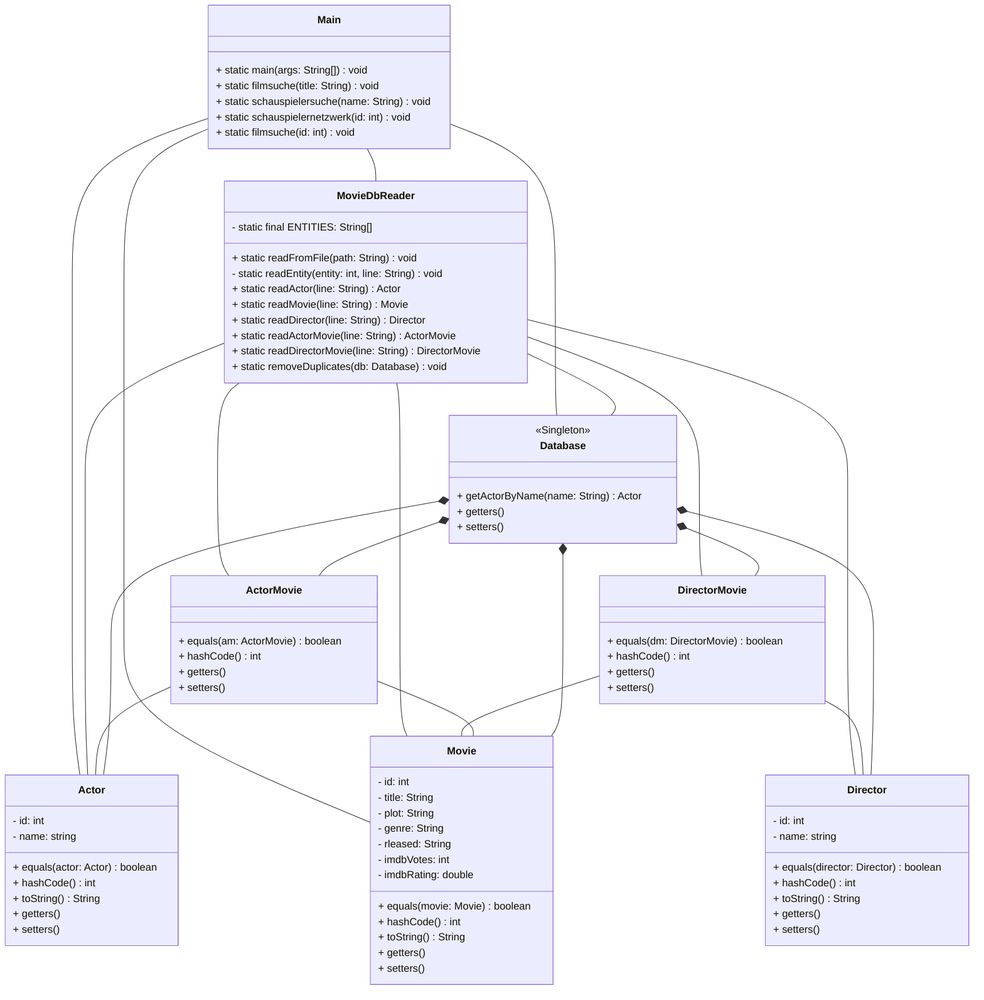

```mermaid
classDiagram
	direction TB

	Database *-- Movie
	Database *-- Actor
	Database *-- Director
	Database *-- ActorMovie
	Database *-- DirectorMovie
	ActorMovie -- Actor
	ActorMovie -- Movie

	DirectorMovie -- Director
	DirectorMovie -- Movie

	MovieDbReader -- Database
	MovieDbReader -- Actor
	MovieDbReader -- Movie
	MovieDbReader -- Director
	MovieDbReader -- ActorMovie
	MovieDbReader -- DirectorMovie

	Main -- Database
	Main -- MovieDbReader
	Main -- Actor
	Main -- Movie


	class Database {
		<<Singleton>>
		+ getActorByName(name: String) Actor
		+ getters()
		+ setters()
	}

	class Actor {
		- id: int
		- name: string
		+ equals(actor: Actor) boolean
		+ hashCode() int
		+ toString() String
		+ getters()
		+ setters()
		
	}

	class Director {
		- id: int
		- name: string
		+ equals(director: Director) boolean
		+ hashCode() int
		+ toString() String
		+ getters()
		+ setters()
	}

	class Movie {
		- id: int
		- title: String
		- plot: String
		- genre: String
		- rleased: String
		- imdbVotes: int
		- imdbRating: double
		+ equals(movie: Movie) boolean
		+ hashCode() int
		+ toString() String
		+ getters()
		+ setters()
	}


	class ActorMovie {
		+ equals(am: ActorMovie) boolean
		+ hashCode() int
		+ getters()
		+ setters()
	}
	
	class DirectorMovie {
		+ equals(dm: DirectorMovie) boolean
		+ hashCode() int
		+ getters()
		+ setters()
	}

	class Main {
		+ static main(args: String[]) void
		+ static filmsuche(title: String) void
		+ static schauspielersuche(name: String) void
		+ static schauspielernetzwerk(id: int) void
		+ static filmsuche(id: int) void
	}

	class MovieDbReader {
		- static final ENTITIES: String[]
		+ static readFromFile(path: String) void
		- static readEntity(entity: int, line: String) void
		+ static readActor(line: String) Actor
		+ static readMovie(line: String) Movie
		+ static readDirector(line: String) Director
		+ static readActorMovie(line: String) ActorMovie
		+ static readDirectorMovie(line: String) DirectorMovie
		+ static removeDuplicates(db: Database) void
	}

```